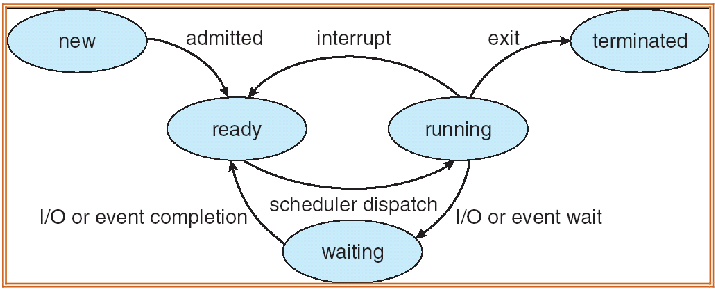

# KernelSimulator

A C#-based simulation of CPU scheduling and process management inspired by operating system kernel concepts. This project demonstrates how processes move between states and how different scheduling strategies affect execution. The scheduler is currently implementing the FCFS scheduling.

## Features
- Simulates the <a href="assets/state_machine.png">State Diagram</a>
- Logs state transitions with timestamps
- Supports adding multiple processes with arrival times and I/O waits
- Structured codebase for extending with new scheduling algorithms

## Tech Stack
- C#
- .NET
- IDE: Visual Studio or VS Code with C# extension

## State Diagram


## Future Improvements
- Add Priority, SJF, and Round Robin scheduling
- Export logs to a CSV for analysis
- Track important metrics such as throughput etc.

## Getting Started
- make sure to change the path on line 48 to your specific path!!
```bash
git clone https://github.com/delightoluwayemi/KernelSimulator.git
cd KernelSimulator
dotnet run
```